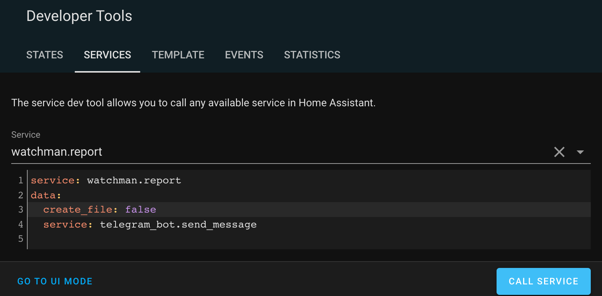
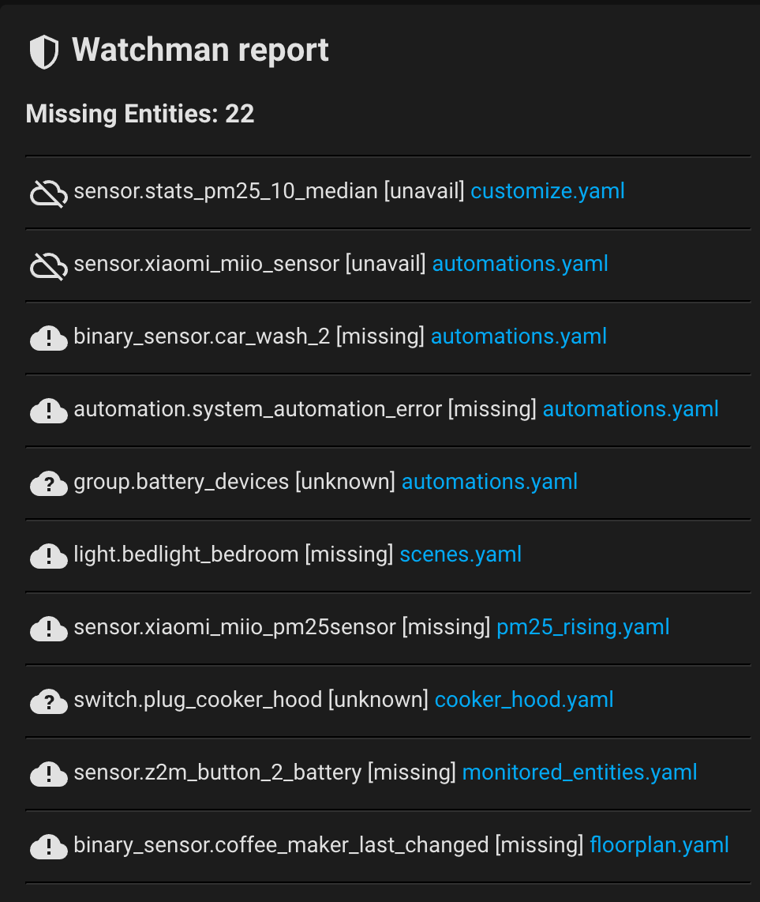
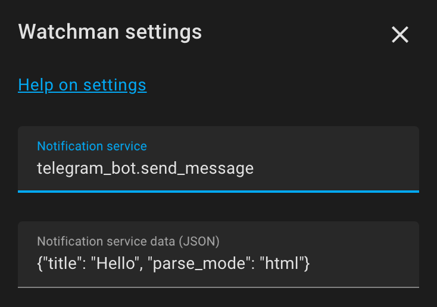
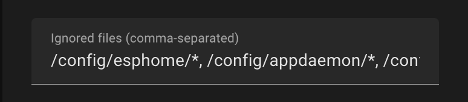

# The Watchman
[](https://github.com/custom-components/hacs)

[![Community Forum][forum-shield]][forum]

The world around us is constantly changing and so is Home Assistant. How often have you found yourself in a situation when your automations had stopped working because some entities become permanently unavailable or services changed their names? For example, Home Assistant companion app can easily change the name of its services and sensors it exposes to Home Assistant if you changed the device name in the app configuration. The watchman is an attempt to control such unwelcome changes and make you able to react proactively, before some critical automation gets broken.

[Discussion on Home Assistant Community Forum](https://community.home-assistant.io/t/watchman-keeps-track-of-missing-entities-and-services-in-your-config-files/390391)

## Quick start

1. Go to the "Integrations" section on HACS, click "Explore and download repositories" and search for "watchman", then click "Download this repository with HACS".
2. Restart Home Assistant, go to Configuration->Devices and Services->Add Integration and select watchman integration.
3. Go to Developer Tools -> Services, type `watchman` and select `Watchman: report` service then press "Call Service" button. Check `watchman_report.txt` file in your configuration directory.

Refer to the [Configutation section](https://github.com/dummylabs/thewatchman#configuration) for further fine-tuning.

## What does it do
The watchman is a custom integration for Home Assistant, which collects all the Home Assistant entities (sensors, timers, input_selects, etc.) mentioned in your yaml configuration files as well as all the services. Having a list of all entities, the app checks their actual state one by one and reports those are not available or missing. For services it checks whether service is available in the HA service registry. The report can be stored as a nice looking text table or it can be send via notification service of choice (unless it is missing too :). The [example of a report](https://github.com/dummylabs/thewatchman#example-of-a-watchman-report) is given below.

The integration has very simple internals, it knows nothing about complex relationships and dependencies among yaml configuration files as well as nothing about the semantics of entities and automations. It parses yaml files line by line and tries to guess references either to an entity or to a service, based on the regular expression heuristics. The above means the integration can give both false positives (something which looks like a duck, swims like a duck, and quacks like a duck, but is not) and false negatives (when some entity in a configuration file was not detected by the integration). To ignore false positives `ignored_items` parameter can be used (see Configuration section below), improvements for false negatives are a goal for future releases.


## Configuration

### Migration from previous versions of watchman
Starting from version 0.4.0 watchman supports both `configuration.yaml` and UI settings. The `watchman` entry from `configuration.yaml` will be automatically imported to UI settings upon the first run of version 0.4.0 or newer. Further changes to `configuration.yaml` will be ignored unless the integration was removed and Home Assistant was restarted afterwards.
UI settings are available in Configuration->Devices and Services section of Home Assistant.

### Options:
All settings are available as UI options thus it is not required to have `watchman` entry in `configuration.yaml` to use integration.

yaml key | Description | Default
------------ | ------------- | -------------
`service` | Home assistant notification service to sent report via, e.g. `notify.telegram`  | `None`
`data` | A yaml dictionary with additional notification service parameters, see [Advanced usage examples](https://github.com/dummylabs/thewatchman#additional-notification-service-parameters-in-configurationyaml) below | `None`
`included_folders` | List of folders to scan for entities and services recursively | `["/config"]`
`report_header` | Custom header for watchman report | `"-== Watchman Report ==-"`
`report_path` | Report file location | `"/config/watchman_report.txt"`
`ignored_items` | List of items to ignore. The entity/service will be excluded from the report if their name matches a rule from the ignore list. Wildcards are supported, see [Configuration example](https://github.com/dummylabs/thewatchman#configuration-example) below. | `None`
`ignored_states` | List of entity states which should be excluded from the report. Possible values are: `missing`, `unavailable`, `unknown` | `None`
`chunk_size` | Maximum message size in bytes. Some notification services, e.g., Telegram, refuse to deliver a message if its size is greater than some internal limit. If report text size exceeds `chunk_size`, the report will be sent in several subsequent notifications. `0` value will disable chunking | `3500`
`ignored_files` | Allows to ignore a specific file or a whole folder using wildcards, see [Advanced usage examples below](https://github.com/dummylabs/thewatchman#exclude-specific-file-or-folder-from-the-report). Takes precedence over `included_folders`.| `None`
`check_lovelace` | Parse Lovelace UI configuration data stored in `.storage` folder (experimental) | `False`
`columns_width` | Report's columns width. The list of column widths for the table version of the report | `[30, 7, 60]`
`startup_delay` | By default, watchman's sensors are updated by `homeassistant_started` event. Some integrations may require extra time for intitialization so that their entities/services may not yet be ready during watchman check. This is especially true for single-board computers like Raspberry PI. This option allows to postpone startup sensors update for certain amount of seconds. | `0`
`friendly_names` | Add friendly names to the report whenever possible | `False`


### yaml configuration example

Not required, starting from 0.4.0 all integration settings can be managed from UI options.

```yaml
watchman:
  ignored_files:
    - "*/automations.yaml" # a file (entries with leading wildcards must be enclosed in quotes)
    - /config/esphome/* # all files in the folder
    - /config/custom_components/*
    - /config/appdaemon/*
    - /config/www/*
  service: telegram_bot.send_message
  data: # any additional parametes for the notification service
    parse_mode: html
  report_path: /config/report.txt
  chunk_size: 2000
  ignored_items:
    - person.dummylabs
    - sensor.* # ignore everything in sensor domain
    - "*.*_ble"  # ignore any entity/service which name ends with "_ble"
  ignored_states:
    - unknown
```

## Watchman.report service

The report can be created by calling `watchman.report` service from Developer Tools UI, an automation or a script. Default location is `/config/thewatchman_report.txt`, it can be altered by `report_path` configuration option.
If no parameters were set, the service will both create a text report and send a notification. A long report will be split into several messages (chunks) due to limitations imposed by some notification services (e.g., telegram). Service behavior can be altered with additional parameters:

 - `create_file` (optional, default=true)
 - `send_notification` (optional, default=false)
 - `service` (optional, overrides eponymous parameter from integration settings)
 - `data`(optional, overrides eponymous parameter from integration settings)
 - `parse_config` (optional, default=false)
 - `chunk_size` (optional, default is 3500 or whatever specified in integration settings)

If `create_file` or `send_notification` flags were not set, they are `true` by default. The parameter `service` allows sending report text via notification service of choice. Along with `data` and `chunk_size` it overrides integration settings.

`parse_config` forces watchman to parse Home Assistant configuration files and rebuild entity and services list. Usually this is not required as watchman will automatically parse files once Home Assistant restarts or tries to reload its configuration.
Also see [Advanced usage examples](https://github.com/dummylabs/thewatchman#advanced-usage-examples) section at the bottom of this document.

### Call service from Home Assistant UI


### Extra notification service parameters example
```yaml
service: watchman.report
create_file: false
data:
  service: telegram_bot.send_message
  data: # additional parameters for your notification service
    parse_mode: html
    target: 111111111 # can be omitted, see telegram_bot documentation
```

## Sensors
Besides of the report, a few sensors will be added to Home Assistant:

- sensor.watchman_missing_entities
- sensor.watchman_missing_services
- sensor.watchman_last_updated

## Example of a watchman report
Please note that the ASCII table format is only used when report is saved to a file. For notification services watchman uses plain text list due to presentation limitations.
```
-== WATCHMAN REPORT ==-

-== Missing 1 service(s) from 38 found in your config:
+--------------------------------+---------+------------------------------------------+
| Service                        | State   | Location                                 |
+--------------------------------+---------+------------------------------------------+
| xiaomi_miio.vacuum_goto        | missing | automations.yaml:599,605                 |
+--------------------------------+---------+------------------------------------------+

-== Missing 3 entity(ies) from 216 found in your config:
+--------------------------------+---------+------------------------------------------+
| Entity                         | State   | Location                                 |
+--------------------------------+---------+------------------------------------------+
| sensor.stats_pm25_10_median    | unavail | customize.yaml:14                        |
| sensor.xiaomi_miio_sensor      | unavail | automations.yaml:231,1348                |
| vacuum.roborock_s5max          | unavail | automations.yaml:589,603,610,1569        |
+--------------------------------+---------+------------------------------------------+

-== Report created on 03 Feb 2022 17:18:55
-== Parsed 200 files in 0.96s., ignored 66 files
-== Generated in: 0.01s. Validated in: 0.00s.
```
The legend at the bottom of the report shows time consumed by 3 coherent stages: parse configuration files, validate each entity/service state and generate text version of the report.

## Markdown card example
Watchman sensors `sensor.watchman_missing_entities` and `sensor.watchman_missing_services` have all required information to make your own report using a lovelace card. Below is an example of missing entities report for the Lovelace markdown card:

```yaml
type: markdown
content: >-
  <h2> <ha-icon icon='mdi:shield-half-full'></ha-icon> Watchman report<h2>
  <h3>Missing Entities: {{ states.sensor.watchman_missing_entities.state }} </h3>
  
  <hr> <table><tr> <td>
  <ha-icon icon='mdi:
  cloud-alert'
  cloud-off-outline' cloud-question'
   ></ha-icon>
  {{ item.id }} [{{item.state}}] <a title="{{item.occurrences}}">
  {{item.occurrences.split('/')[-1].split(':')[0]}}</a>
  </td></tr></table>
  
card_mod:
  style:
    ha-markdown:
      $: |
        ha-markdown-element:first-of-type hr{
          border-color: #303030;
        }

```
Important notes:
1. Make sure you are in code editor mode before pasting this code into the markdown card.
2. `card_mod` section is optional and requires a custom lovelace card for extra styling
3. Put mouse pointer above a file name to see full path to a file and line numbers



The code for the services report looks very similar:

```yaml
type: markdown
content: >-
  <h2 class="some"> <ha-icon icon='mdi:shield-half-full'></ha-icon> Watchman report<h2>
  <h3> Missing Services: {{ states.sensor.watchman_missing_services.state }} </h3>
  
  <hr><table><tr> <td>  <ha-icon icon='mdi:cloud-alert'></ha-icon> {{ item.id }}
  <a title="{{item.occurrences}}">{{item.occurrences.split('/')[-1].split(':')[0]}}</a>
  </td></tr></table>
  
card_mod:
  style:
    ha-markdown:
      $: |
        ha-markdown-element:first-of-type hr{
          border-color: #303030;
        }
```

## Advanced usage examples

### Additional notification service parameters in configuration.yaml
Notification service name can be specified in integration options along with additional service parameters.
#### UI configuration example


#### yaml example
```yaml
watchman:
  service: telegram_bot.send_message
  data:
    title: Hello
    parse_mode: html
```

### Additional notification service parameters in Watchman:report service
You can use an arbitrary notification service with `watchman.report` service. Service paramaters takes precedence over eponymous settings in `configuration.yaml`.
```yaml
service: watchman.report
data:
  service: telegram_bot.send_message
  data:
    title: Hello
    parse_mode: html
```

### Send report as a text file via telegram bot
You should add report folder to the Home Assistant whitelist, otherwise telegram_bot will be unable to pick files from the folder (see example configuration below).
```yaml
service: watchman.report
data:
  service: telegram_bot.send_document
  data:
    file: '/config/thewatchman_report.txt'
```
:warning: Whitelisting the configuration folder can be unsafe, use it at your own risk or put report file in a separate folder.
```yaml
homeassistant:
  allowlist_external_dirs:
    - /config/
```

### Exclude specific file or folder from the report
Specific files or even whole folders can be excluded from the report using wildcards, see example below. Wildcards in configuration file should be enclosed in quotes.

#### UI configuration example


#### yaml example
```yaml
watchman:
  ignored_files:
    # wildcards must be enclosed in quotes!
    - "*.yaml" # exclude all yaml files from the report (useless)
    - "/config/entities/*" # exclude all files in /config/entities
    - "*/automations.yaml" # exclude automations.yaml file only
```

[forum-shield]: https://img.shields.io/badge/community-forum-brightgreen.svg?style=popout
[forum]: https://community.home-assistant.io/t/watchman-keeps-track-of-missing-entities-and-services-in-your-config-files/390391